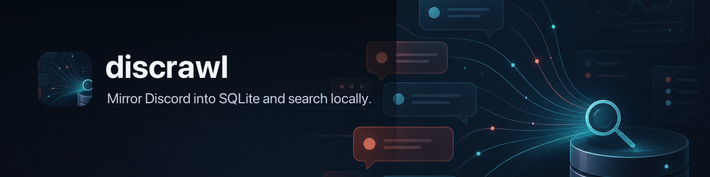

     1|# discrawl 🛰️ — Mirror Discord into SQLite; search server history locally
     2|
     3|
     4|
     5|`discrawl` mirrors Discord guild data into local SQLite so you can search, inspect, and query server history without depending on Discord search. It can also import classifiable Discord Desktop cache messages for local DM recovery/search without using a user token. Teams can publish the guild archive as a private Git snapshot repo, so readers get fresh org memory without Discord bot credentials. Read-only Cloudflare remote archives can be configured without creating a local SQLite database.
     6|
     7|There are two local archive sources:
     8|
     9|- Discord bot API sync for guilds, channels, members, threads, and message history the configured bot can access
    10|- Discord Desktop cache import for local, classifiable cached messages, including proven local-only DMs under `@me`
    11|
    12|Desktop wiretap mode reads local cache artifacts only. It does not extract credentials, use user tokens, call the Discord API as your user, or run a selfbot.
    13|
    14|Wiretap DMs stay local and are never exported to the Git-backed snapshot mirror.
    15|
    16|## What It Does
    17|
    18|- discovers every guild the configured token can access
    19|- syncs channels, threads, members, and message history into SQLite
    20|- maintains FTS5 search indexes for fast local text search
    21|- builds an offline member directory from archived profile payloads
    22|- extracts small text-like attachments into the local search index
    23|- downloads and backs up cached attachment media when requested
    24|- records structured user and role mentions for direct querying
    25|- tails Gateway events for live updates, with periodic repair syncs
    26|- imports classifiable Discord Desktop cache messages with `wiretap`, including proven DMs under `@me`
    27|- publishes and imports private Git-backed archive snapshots for org-wide read access
    28|- browses stored messages and local DMs in a terminal archive UI
    29|- exposes `metadata --json`, `status --json`, and `doctor --json` for local
    30|  launchers, automation, and CI
    31|- reports Worker-fronted cloud archive status in read-only mode without
    32|  touching local SQLite
    33|- supports Git-only read mode with no Discord credentials on reader machines
    34|- generates backup README activity reports, with optional AI-written field notes
    35|- exposes read-only SQL for ad hoc analysis
    36|- keeps schema multi-guild ready while preserving a simple single-guild default UX
    37|
    38|Search defaults to all guilds. `sync` and `tail` default to the configured default guild when one exists, otherwise they fan out to all discovered guilds.
    39|
    40|## Requirements
    41|
    42|- Go `1.26+`
    43|- for publishing/syncing guilds: a Discord bot token the bot can use to read the target guilds
    44|- for DM wiretap import: local Discord Desktop cache files on the same machine
    45|- for read-only Git-backed access: access to a private snapshot repo, no Discord credentials required
    46|- bot permissions for the channels you want archived when running `sync` or `tail`
    47|
    48|### Discord Bot Setup
    49|
    50|`discrawl` needs a real bot token. Not a user token.
    51|
    52|Minimum practical setup:
    53|
    54|1. Create or reuse a Discord application in the Discord developer portal.
    55|2. Add a bot user to that application.
    56|3. Invite the bot to the target guilds.
    57|4. Enable these intents for the bot:
    58|   - `Server Members Intent`
    59|   - `Message Content Intent`
    60|5. Ensure the bot can at least:
    61|   - view channels
    62|   - read message history
    63|
    64|Without those intents/permissions, `sync`, `tail`, member snapshots, or message content archiving will be partial or fail.
    65|
    66|### Bot Token Sources
    67|
    68|Token resolution:
    69|
    70|1. `DISCORD_BOT_TOKEN` or the configured `discord.token_env`
    71|2. OS keyring item `discrawl` / `discord_bot_token`, or the configured keyring service/account
    72|
    73|`discrawl` accepts either raw token text or a value prefixed with `Bot `. It normalizes that automatically.
    74|
    75|Fastest path:
    76|
    77|```bash
    78|export DISCORD_BOT_TOKEN="your-bot-token"
    79|discrawl doctor
    80|discrawl init
    81|```
    82|
    83|If you keep shell secrets in `~/.profile`, add:
    84|
    85|```bash
    86|export DISCORD_BOT_TOKEN="your-bot-token"
    87|```
    88|
    89|Then reload your shell before running `discrawl`.
    90|
    91|If you prefer the OS keyring, keep the token out of config and store it in the default keyring item:
    92|
    93|```bash
    94|# macOS Keychain
    95|security add-generic-password -U -s discrawl -a discord_bot_token -w "$DISCORD_BOT_TOKEN"
    96|
    97|# Linux Secret Service / libsecret
    98|printf %s "$DISCORD_BOT_TOKEN" | secret-tool store --label="discrawl Discord bot token" service discrawl username discord_bot_token
    99|
   100|# Windows Credential Manager
   101|cmdkey /generic:discrawl:discord_bot_token /user:discord_bot_token /pass:%DISCORD_BOT_TOKEN%
   102|```
   103|
   104|Set `discord.token_source = "keyring"` if you want to require keyring lookup instead of env-first fallback.
   105|
   106|Default runtime paths follow the OS convention instead of writing a new top-level directory in
   107|your home folder. Linux uses the XDG Base Directory variables. macOS uses `~/Library` folders,
   108|unless you set XDG variables yourself.
   109|
   110|- Linux config: `${XDG_CONFIG_HOME:-~/.config}/discrawl/config.toml`
   111|- Linux database/share: `${XDG_DATA_HOME:-~/.local/share}/discrawl/`
   112|- Linux cache: `${XDG_CACHE_HOME:-~/.cache}/discrawl/`
   113|- Linux logs: `${XDG_STATE_HOME:-~/.local/state}/discrawl/logs/`
   114|- macOS config/database/share/logs: `~/Library/Application Support/discrawl/`
   115|- macOS cache: `~/Library/Caches/discrawl/`
   116|
   117|Upgrades do not move your database automatically. Existing installs that
   118|already have `~/.discrawl/config.toml` continue to load that config when the
   119|new default config file does not exist. Missing runtime paths also keep using
   120|existing legacy files or directories, such as `~/.discrawl/discrawl.db`, until
   121|the matching new path exists. To migrate deliberately, copy or create the new
   122|config file first, or point Discrawl at it with `--config` / `DISCRAWL_CONFIG`,
   123|then copy the database/share/cache/log paths you want to move.
   124|
   125|## Install
   126|
   127|Homebrew (recommended):
   128|
   129|```bash
   130|brew install openclaw/tap/discrawl
   131|discrawl --version
   132|```
   133|
   134|Check for newer releases manually with:
   135|
   136|```bash
   137|discrawl check-update
   138|```
   139|
   140|Interactive terminal runs also perform a cached daily release check and print a
   141|stderr notice when a newer Discrawl release is available. Set
   142|`DISCRAWL_NO_UPDATE_CHECK=1` or `CRAWLKIT_NO_UPDATE_CHECK=1` to disable that
   143|passive notice.
   144|
   145|Build from source:
   146|
   147|```bash
   148|git clone https://github.com/openclaw/discrawl.git
   149|cd discrawl
   150|go build -o bin/discrawl ./cmd/discrawl
   151|./bin/discrawl --version
   152|```
   153|
   154|Docker:
   155|
   156|```bash
   157|docker build -t discrawl .
   158|docker run --rm -e DISCORD_BOT_TOKEN -v "$PWD/.discrawl:/data" discrawl doctor
   159|docker run --rm -e DISCORD_BOT_TOKEN -v "$PWD/.discrawl:/data" discrawl sync
   160|```
   161|
   162|The image stores config, SQLite data, cache, and Git snapshot state under `/data`.
   163|
   164|Examples below assume `discrawl` is on `PATH`. If you built from source without installing it, replace `discrawl` with `./bin/discrawl`.
   165|
   166|## Quick Start
   167|
   168|Configure a Discord bot token and refresh both bot-visible guild data and local desktop cache data:
   169|
   170|```bash
   171|export DISCORD_BOT_TOKEN="..."
   172|discrawl init
   173|discrawl doctor
   174|discrawl sync --full
   175|discrawl sync
   176|discrawl search "panic: nil pointer"
   177|discrawl tail
   178|```
   179|
   180|Use `discrawl sync --source wiretap` when you only want the local Discord Desktop cache import and do not want bot-token API sync.
   181|
   182|Git-only reader setup:
   183|
   184|```bash
   185|discrawl subscribe https://github.com/example/discord-archive.git
   186|discrawl search "launch checklist"
   187|discrawl messages --channel general --hours 24
   188|```
   189|
   190|`init` discovers accessible guilds and writes the default XDG config file. If
   191|exactly one guild is available, that guild becomes the default automatically.
   192|`subscribe` writes a token-free config, imports the private Git snapshot, and
   193|read commands auto-refresh when the local snapshot is older than `15m`.
   194|
   195|`doctor` is the fastest sanity check:
   196|
   197|- confirms config can be loaded
   198|- shows where the token was resolved from
   199|- verifies Discord auth
   200|- shows how many guilds the token can access
   201|- verifies DB + FTS wiring
   202|
   203|## Commands
   204|
   205|### `tui`
   206|
   207|Opens the local terminal archive browser for stored messages.
   208|
   209|```bash
   210|discrawl tui
   211|discrawl tui --guild 123456789012345678 --channel general
   212|discrawl tui --dm
   213|discrawl --json tui --limit 50
   214|```
   215|
   216|The terminal browser uses the shared crawlkit explorer. The left pane groups
   217|channels, people, or threads; the middle pane lists messages; the right pane
   218|shows the selected message, surrounding conversation, and thread detail. Mouse
   219|selection, right-click actions, sortable headers, and the local/remote footer
   220|follow the same interaction model as `gitcrawl tui`. See
   221|[`docs/commands/tui.md`](docs/commands/tui.md) for flags and read-only/DM scope
   222|notes.
   223|
   224|### `init`
   225|
   226|Creates the local config and discovers accessible guilds.
   227|
   228|```bash
   229|discrawl init
   230|discrawl init --guild 123456789012345678
   231|discrawl init --db ~/data/discrawl.db
   232|```
   233|
   234|### `sync`
   235|
   236|Refreshes SQLite from one or both archive sources.
   237|
   238|By default, `sync` runs both live/local sources and does not import the Git snapshot first:
   239|
   240|- Discord bot-token sync for bot-visible guild data
   241|- local Discord Desktop cache import for classifiable cached messages and proven DMs
   242|
   243|Use `discrawl update` when you want to pull/import the shared Git snapshot. If you intentionally want a sync run to import the snapshot before live deltas, pass `--update=auto` to import only when stale or `--update=force` to pull/import before syncing. `--no-update` is accepted as an explicit no-op alias for the default.
   244|
   245|Run one explicit `--full` pass when you want a complete historical guild archive. Use plain `sync` afterward for frequent latest-message and desktop-cache refreshes.
   246|
   247|```bash
   248|discrawl sync
   249|discrawl sync --update=auto
   250|discrawl sync --update=force
   251|discrawl sync --no-update
   252|discrawl sync --full
   253|discrawl sync --full --all
   254|discrawl sync --guild 123456789012345678
   255|discrawl sync --guilds 123,456 --concurrency 8
   256|discrawl sync --source both      # default: bot API + desktop cache
   257|discrawl sync --source discord   # bot API only; aliases: key, bot, api
   258|discrawl sync --source wiretap   # desktop cache only; aliases: desktop, cache
   259|discrawl sync --guild 123456789012345678 --all-channels
   260|discrawl sync --channels 111,222 --since 2026-03-01T00:00:00Z
   261|```
   262|
   263|Sync sources:
   264|
   265|| Source | Reads from | Stores |
   266|| --- | --- | --- |
   267|| `both` | Discord bot API and local Discord Desktop cache | bot-visible guild data plus classifiable cached desktop messages |
   268|| `discord` / `key` | Discord bot API | guilds, channels, threads, members, and messages the bot can access |
   269|| `wiretap` | local Discord Desktop cache files | classifiable cached messages; proven DMs are stored under `@me` |
   270|
   271|Sync modes control the Discord bot API side of a run. When `wiretap` is selected, the desktop cache import runs once alongside the chosen bot sync mode.
   272|
   273|Bot sync modes:
   274|
   275|| Command | Use when | Behavior |
   276|| --- | --- | --- |
   277|| `discrawl sync` | routine refresh | skips member refreshes, checks live top-level channels plus active threads, and only fetches new messages for channels with a stored latest cursor |
   278|| `discrawl sync --update=auto` | hybrid Git/live refresh | imports a stale Git snapshot first, then runs the routine live refresh |
   279|| `discrawl sync --all-channels` | repair pass | broad incremental sweep across every stored channel/thread, including archived threads |
   280|| `discrawl sync --full` | historical backfill | crawls older history until channels are complete; can take a long time on large servers |
   281|
   282|`sync` already uses parallel channel workers for bot API message crawling.
   283|`--concurrency` overrides the default, and the default is auto-sized from `GOMAXPROCS` with a floor of `8` and a cap of `32`.
   284|`--all` ignores `default_guild_id` and fans out across every discovered guild the bot can access.
   285|`--skip-members` refreshes guild/channel/message data without crawling the full member list, which is useful for frequent Git snapshot publishers that only need latest messages.
   286|`--latest-only` is still accepted for explicit latest-only runs; it is now the default for untargeted `sync`. Use `--all-channels` to opt out of the fast default without doing a full historical crawl.
   287|`--with-media` downloads missing attachment media into `cache_dir/media` after the message sync/import phase. Discord attachment URLs can expire or disappear; those downloads are marked `failed` with the HTTP status, usually `404`, while successfully fetched files remain cached and can still be published.
   288|When `--channels` includes a forum channel id, `discrawl` expands that forum's threads and syncs their messages as part of the targeted run.
   289|`--since` limits initial history/bootstrap and full-history backfill to messages at or after the given RFC3339 timestamp. It does not mark older history as complete, so a later `sync --full` without `--since` can continue the backfill.
   290|Long runs now emit periodic progress logs to stderr so large backfills and Git snapshot imports do not look hung.
   291|If in-flight channels stop completing for a while, `discrawl` now emits `message sync waiting` heartbeat logs with the oldest active channel, per-channel page activity, and skip/defer counters, and every run ends with a `message sync finished` summary.
   292|Each channel crawl also has a bounded runtime budget, so a pathological channel is deferred and retried on the next sync instead of pinning a worker forever.
   293|Retryable failures and unavailable-channel markers are tracked per channel; stale unavailable markers are cleared after a later successful crawl, and marker cleanup is best-effort so one missing local sync-state row cannot crash the run.
   294|Full sync member refresh is best-effort and currently gives up after five minutes without a caller-supplied deadline, so message sync completion is not held hostage by a slow guild member crawl.
   295|When the archive is already complete, `sync --full` now reuses the stored backlog markers and limits steady-state refresh to live top-level channels plus active threads instead of revisiting every stored archived thread.
   296|If a guild already has a local member snapshot, routine syncs reuse it and skip another full member crawl until that snapshot ages out.
   297|
   298|### `tail`
   299|
   300|Runs the live Gateway tail and periodic repair loop.
   301|
   302|```bash
   303|discrawl tail
   304|discrawl tail --guild 123456789012345678
   305|discrawl tail --repair-every 30m
   306|```
   307|
   308|### `wiretap`
   309|
   310|Imports classifiable Discord Desktop message payloads into the same local SQLite archive.
   311|
   312|This is the path for searchable DMs because bot tokens cannot read personal direct messages.
   313|
   314|`wiretap` is also available through `discrawl sync --source wiretap` and is included in the default `discrawl sync --source both` path.
   315|
   316|```bash
   317|discrawl wiretap
   318|discrawl wiretap --path "$HOME/Library/Application Support/discord"
   319|discrawl wiretap --dry-run
   320|discrawl wiretap --full-cache
   321|discrawl wiretap --watch-every 2m
   322|```
   323|
   324|Notes:
   325|
   326|- stores classifiable cache messages in the same `guilds`, `channels`, and `messages` tables used by bot sync
   327|- stores proven DMs under the synthetic guild id `@me`
   328|- keeps `@me` rows local-only: `publish`, Git snapshot import/export, and optional embedding snapshot export exclude DM guilds, channels, messages, events, attachments, mentions, wiretap sync state, and vectors for DM messages
   329|- preserves existing local `@me` guilds, channels, messages, and attachments when importing a Git snapshot, so a shared guild mirror refresh does not wipe local wiretap DM search
   330|- drops message payloads whose channel cannot be classified from cached channel metadata or Discord route URLs; dropped rows are counted as `skipped_messages`
   331|- imports what Discord Desktop has cached locally, not complete live DM history
   332|- scans local `.ldb`, `.log`, `.json`, and `.txt` artifacts for Discord message JSON, plus route-bearing Chromium HTTP cache entries by default
   333|- use `--full-cache` or `desktop.full_cache = true` for exhaustive Chromium cache import when you want slower historical guild-cache archaeology
   334|- does not extract, store, or print Discord auth tokens
   335|- `--max-file-bytes` skips unusually large files; default is 64 MiB
   336|
   337|### `search`
   338|
   339|Searches archived messages. FTS is the default mode and works without embeddings.
   340|
   341|```bash
   342|discrawl search "panic: nil pointer"
   343|discrawl search --mode fts "panic: nil pointer"
   344|discrawl search --mode semantic "missing launch checklist"
   345|discrawl search --mode hybrid "database timeout"
   346|discrawl search --guild 123456789012345678 "payment failed"
   347|discrawl search --dm "launch checklist"
   348|discrawl search --channel billing --author steipete --limit 50 "invoice"
   349|discrawl search --include-empty "GitHub"
   350|discrawl --json search "websocket closed"
   351|```
   352|
   353|By default, `search` skips rows with no searchable content. Attachment text, attachment filenames, embeds, and replies still count as content. Use `--include-empty` to opt back in.
   354|
   355|Modes:
   356|
   357|- `fts` searches the local FTS index and returns the newest matching messages first.
   358|- `semantic` embeds the query, searches locally stored message vectors, and returns a clear error if embeddings are disabled or no compatible vectors exist.
   359|- `hybrid` runs FTS and semantic search, deduplicates by message id, and falls back to FTS when semantic search is unavailable.
   360|
   361|FTS uses SQLite FTS5 with the default `unicode61` tokenizer. User query terms are parameterized and quoted before `MATCH`, so tokens like `AND`, `OR`, `NOT`, `NEAR`, and `*` are searched as input terms instead of FTS operators. Punctuation still follows FTS5 tokenization rules.
   362|
   363|Semantic and hybrid search require `[search.embeddings]` plus local `message_embeddings` rows for the configured provider, model, and input version. Run `discrawl sync --with-embeddings` to enqueue changed messages, then `discrawl embed` to generate vectors. The input version is currently `message_normalized_v1`, so vectors are tied to normalized message text rather than raw Discord payloads.
   364|
   365|### `messages`
   366|
   367|Lists exact message slices by channel, author, and time range.
   368|
   369|```bash
   370|discrawl messages --channel maintainers --days 7 --all
   371|discrawl messages --channel maintainers --hours 6 --all
   372|discrawl messages --channel "#maintainers" --since 2026-03-01T00:00:00Z
   373|discrawl messages --channel 1456744319972282449 --author steipete --limit 50
   374|discrawl messages --channel maintainers --last 100 --sync
   375|discrawl messages --dm --channel Molty --last 20
   376|discrawl messages --channel maintainers --days 7 --all --include-empty
   377|discrawl --json messages --channel maintainers --days 3
   378|```
   379|
   380|Notes:
   381|
   382|- `--channel` accepts a channel id, exact name, `#name`, or partial name match
   383|- `--hours` is shorthand for "since now minus N hours"
   384|- `--days` is shorthand for "since now minus N days"
   385|- `--last` returns the newest `N` matching messages, then prints them oldest-to-newest
   386|- `--all` removes the safety limit; default is `200`
   387|- `--sync` runs a blocking pre-query sync for the matching channel or guild scope before reading the local DB
   388|- rows with no displayable/searchable content are skipped by default; `--include-empty` opts back in
   389|- at least one filter is required
   390|- `--dm` is shorthand for `--guild @me`, so DM searches and message slices do not need raw SQL
   391|
   392|### `attachments`
   393|
   394|Lists attachment metadata and downloads media into the local cache when requested.
   395|
   396|```bash
   397|discrawl attachments --channel general --days 7
   398|discrawl attachments --filename crash --type image --all
   399|discrawl attachments fetch --channel general --days 7
   400|discrawl attachments fetch --missing --max-bytes 104857600
   401|```
   402|
   403|Media bytes are stored under `cache_dir/media`, not in SQLite. SQLite stores attachment metadata, content hash, relative media path, fetch status, and fetch error. `attachments fetch` and `sync --with-media` only populate the local cache; run `publish --push` afterward to copy cached non-DM media into the Git backup. Cached non-DM media is included in Git snapshots by default; `publish --no-media` omits it.
   404|
   405|### `dms`
   406|
   407|Lists local wiretap DM conversations or reads one DM thread.
   408|
   409|```bash
   410|discrawl dms
   411|discrawl dms --with Molty --last 20
   412|discrawl dms --with 1456464433768300635 --all
   413|discrawl dms --search "launch checklist"
   414|discrawl dms --with Molty --search "invoice"
   415|```
   416|
   417|`discrawl dms` shows one row per local DM channel with message count, author count, and first/last cached message times. Passing `--with` switches to message output for that DM conversation unless `--list` is also set. `--search` searches only local DM messages. This is a convenience layer over the local-only synthetic guild id `@me`; it skips Git snapshot auto-update because DMs are never imported from the shared mirror, and it still only sees Discord Desktop cache data imported by `wiretap`.
   418|
   419|### `mentions`
   420|
   421|Lists structured user and role mentions.
   422|
   423|```bash
   424|discrawl mentions --channel maintainers --days 7
   425|discrawl mentions --target steipete --type user --limit 50
   426|discrawl mentions --target 1456406468898197625
   427|discrawl --json mentions --type role --days 1
   428|```
   429|
   430|Notes:
   431|
   432|- `--target` accepts an id, exact name, or partial name match
   433|- `--type` can be `user` or `role`
   434|- same guild/time filters as `messages`
   435|
   436|### `sql`
   437|
   438|Runs read-only SQL against the local database.
   439|
   440|```bash
   441|discrawl sql 'select count(*) as messages from messages'
   442|echo 'select guild_id, count(*) from messages group by guild_id' | discrawl sql -
   443|```
   444|
   445|### `members`
   446|
   447|```bash
   448|discrawl members list
   449|discrawl members show 123456789012345678
   450|discrawl members show --messages 10 steipete
   451|discrawl members search "peter"
   452|discrawl members search "github"
   453|discrawl members search "https://github.com/steipete"
   454|```
   455|
   456|Notes:
   457|
   458|- `search` matches names plus any offline profile fields present in the archived member payload
   459|- `show` accepts a user id or query; if it resolves to one member, it also shows recent messages
   460|- extracted profile fields may include `bio`, `pronouns`, `location`, `website`, `x`, `github`, and discovered URLs
   461|- if the bot cannot see a field from Discord, `discrawl` cannot invent it; this is strictly archive-based offline data
   462|
   463|Typical workflow:
   464|
   465|```bash
   466|discrawl sync --full
   467|discrawl members search "design engineer"
   468|discrawl members search "github"
   469|discrawl members show --messages 25 steipete
   470|discrawl messages --author steipete --days 30 --all
   471|```
   472|
   473|Typical `members show` output:
   474|
   475|```text
   476|guild=1456350064065904867
   477|user=37658261826043904
   478|username=steipete
   479|display=Peter Steinberger
   480|joined=2026-03-08T16:03:14Z
   481|bot=false
   482|x=steipete
   483|github=steipete
   484|website=https://steipete.me
   485|bio=Builds native apps and tooling.
   486|urls=https://steipete.me, https://github.com/steipete
   487|message_count=1284
   488|first_message=2026-02-01T09:00:00Z
   489|last_message=2026-03-08T15:59:58Z
   490|```
   491|
   492|Searchable member data comes from:
   493|
   494|- Discord member/user payload fields archived into `members.raw_json`
   495|- explicit profile fields when Discord exposes them
   496|- URLs and social handles inferred from archived profile text
   497|- current member snapshot data such as names, nick, roles, and join time
   498|
   499|### `channels`
   500|
   501|